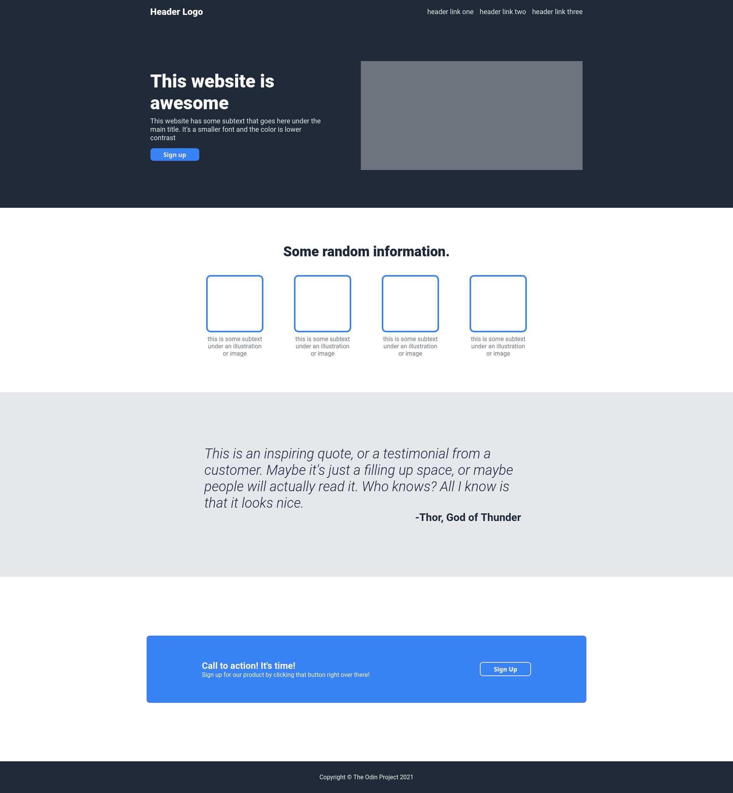

# odin-landing-page
The Odin Project assignment to create simple landing page using flexbox

## Table of contents
* [General info](#general-info)
* [Technologies](#technologies)
* [Screenshot](#screenshot)
* [Link](#link)

## General info
This is an exercise from The Odin Project to create simple landing page using HTML and CSS flexbox. Nowadays flexbox is used widely to build responsive web pages. This technology allows flexibility in aligning web content and responsive page across many devices.

## Technologies
Project is created with:
* HTML
* CSS
	
## Screenshot

## Link
https://rhinzz.github.io/odin-landing-page/
